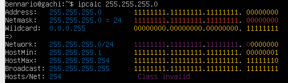
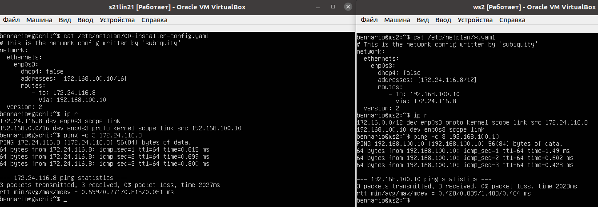
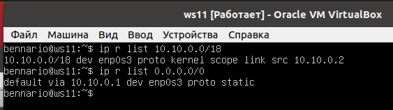
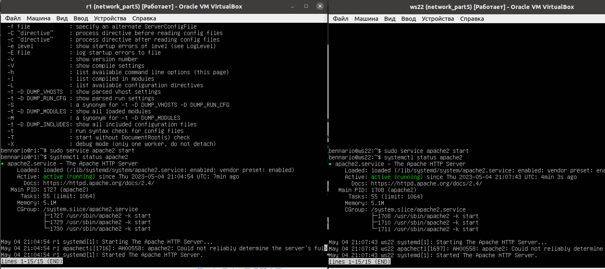
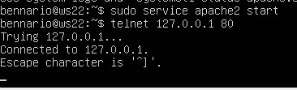

# Linux Network
## Contents
Part 1. [Инструмент ipcalc](#part-1-инструмент-ipcalc)
- 1.1. [Сети и маски](#11сети-и-маски)
- 1.2. [localhost](#12localhost)
- 1.3. [Диапазоны и сегменты сетей](#13-диапазоны-и-сегменты-сетей)

Part 2. [Статическая маршрутизация между двумя машинами](#part-2-статическая-маршрутизация-между-двумя-машинами)

- 2.1. [Добавление статического маршрута вручную](#21-добавление-статического-маршрута-вручную)
- 2.2. [Добавление статического маршрута с сохранением](#22-добавление-статического-маршрута-с-сохранением)

Part 3. [Утилита iperf3](#part-3-утилита-iperf3)
- 3.1. [Скорость соединения](#31-скорость-соединения)
- 3.2. [Утилита iperf3](#32-утилита-iperf3)

Part 4. [Сетевой экран](#part-4-сетевой-экран)

- 4.1. [Утилита iptables](#41-утилита-iptables)
- 4.2. [Утилита nmap](#42-утилита-nmap)

Part 5. [Статическая маршрутизация сети](#part-5-статическая-маршрутизация-сети)

- 5.1. [Настройка адресов машин](#51-настройка-адресов-машин)
- 5.2. [Включение переадресации IP-адресов](#52-включение-переадресации-ip-адресов)
- 5.3. [Установка маршрута по-умолчанию](#53-установка-маршрута-по-умолчанию)
- 5.4. [Добавление статических маршрутов](#54-добавление-статических-маршрутов)
- 5.5. [Построение списка маршрутизаторов](#55-построение-списка-маршрутизаторов)
- 5.6. [Использование протокола ICMP при маршрутизации](#56-использование-протокола-icmp-при-маршрутизации)

Part 6. [Динамическая настройка IP с помощью DHCP](#part-6-динамическая-настройка-ip-с-помощью-dhcp)

Part 7. [NAT](#part-7-nat) 

Part 8. [Допополнительно. Знакомство с SSH Tunnels](#part-8-дополнительно-знакомство-с-ssh-tunnels)

----
## Part 1. Инструмент ipcalc

----
#### 1.1. Сети и маски
`Префиксы маски в DevOps` - это набор значений, используемых для определения диапазона IP-адресов в сети. Они используются в связке с `маской` подсети для определения, какие IP-адреса принадлежат к одной подсети, а какие к другой.

`Маска в DevOps` - это значение, используемое для определения `диапазона IP-адресов в сети`. Она используется вместе с IP-адресом для определения, какие адреса принадлежат к одной подсети, а какие к другой. Маска выражается в виде четырех десятичных чисел, разделенных точками, каждое из которых может принимать значение от 0 до 255.

`Диапазон IP-адресов в сети в DevOps` - это группа адресов, назначенных устройствам в сети для идентификации и общения между ними. Каждый IP-адрес уникален в пределах сети, и их диапазон определяется посредством использования маски подсети.

Таблица сетевых масок, префиксы маски. Короткая запись маски.


1. 
``` brew
Адрес сети 192.167.38.54/13
```


2. 
``` brew
Перевод маски 255.255.255.0 в префиксную и двоичную запись
```
Перевод маски 255.255.255.0 в префиксную и двоичную запись происходит следующим образом:

- Перевод в двоичную запись: каждое значение маски в десятичной форме переводится в двоичный код. Например, 255 в двоичном коде выглядит как 11111111. Получим двоичный код маски: 11111111.11111111.11111111.00000000

- Перевод в префиксную запись: количество единиц в двоичном коде маски указывает на длину префикса. В данном случае, количество единиц равно 24, что означает, что префикс 255.255.255.0 в десятичной форме может быть записан как /24.




``` brew
/15 в обычную и двоичную
```
Перевод маски /15 в обычную и двоичную формы происходит следующим образом:

Перевод в обычную форму: каждый бит в маске может быть либо единицей (1), либо нулем (0). Число /15 указывает на количество единиц в маске. Таким образом, маска /15 в обычной форме может быть записана как 255.254.0.0

Перевод в двоичную форму: каждое значение в обычной форме переводится в двоичный код. Например, 255 в двоичном коде выглядит как 11111111. Получим двоичный код маски: 11111111.11111110.00000000.00000000.


``` brew
11111111.11111111.11111111.11110000 в обычную и префиксную
```

Перевод 11111111.11111111.11111111.11110000 в обычную и префиксную форму маски происходит следующим образом:

Перевод в обычную форму: данное двоичное представление маски соответствует значению 255.255.255.240

Перевод в префиксную форму: количество единиц в маске определяет длину префикса. Таким образом, длина префикса для данной маски равна 28, то есть /28.


3.

Минимальный и максимальный хосты в сети нужны для разделения IP-адресов в подсети на две части: одну для адресов устройств в сети и другую для адресов шлюзов или специальных адресов.

Минимальный хост - это первый доступный для использования IP-адрес в подсети, который может быть присвоен устройству в сети.

Максимальный хост - это последний доступный для использования IP-адрес в подсети, который может быть присвоен устройству в сети.

Использование минимального и максимального хостов помогает системам управления сетями лучше организовывать и администрировать адресацию IP в сети.

``` brew
Минимальный и максимальный хост в сети 12.167.38.4 при маске /8
```


``` brew
Минимальный и максимальный хост в сети 12.167.38.4 при маске 11111111.11111111.00000000.00000000
```


``` brew
Минимальный и максимальный хост в сети 12.167.38.4 при маске 255.255.254.0
```


``` brew
Минимальный и максимальный хост в сети 12.167.38.4 при маске /4
```


#### [Вернуться к оглавлению](#linux-network)

#### 1.2.localhost
##### Определить и записать в отчёт, можно ли обратиться к приложению, работающему на localhost, со следующими IP: *194.34.23.100*, *127.0.0.2*, *127.1.0.1*, *128.0.0.1*
- *127.0.0.2*, *127.1.0.1* - возможно Loopback
- *194.34.23.100*, *128.0.0.1* - невозможно

Loopback на localhost - это специальный IP-адрес (127.0.0.1), используемый для обращения к собственному компьютеру. Он используется для тестирования сетевых услуг и приложений на локальном компьютере, а также для установления сетевых соединений между различными приложениями на одном компьютере. Он также известен как loopback-интерфейс.


#### [Вернуться к оглавлению](#linux-network)

#### 1.3. Диапазоны и сегменты сетей
##### Определить и записать в отчёт:
##### 1) какие из перечисленных IP можно использовать в качестве публичного, а какие только в качестве частных: *10.0.0.45*, *134.43.0.2*, *192.168.4.2*, *172.20.250.4*, *172.0.2.1*, *192.172.0.1*, *172.68.0.2*, *172.16.255.255*, *10.10.10.10*, *192.169.168.1*

IP-адреса можно разделить на две категории: публичные и частные. Публичные IP-адреса могут быть использованы для подключения к Интернету, тогда как частные IP-адреса используются только внутри частных сетей.

Публичные IP-адреса находятся в следующих диапазонах:

IPv4:

24.0.0.0 - 24.255.255.255
40.0.0.0 - 40.255.255.255
47.0.0.0 - 47.255.255.255
50.0.0.0 - 50.255.255.255
58.0.0.0 - 58.255.255.255
100.64.0.0 - 100.127.255.255
169.254.0.0 - 169.254.255.255
172.16.0.0 - 172.31.255.255
198.18.0.0 - 198.19.255.255
192.0.0.0 - 192.0.0.255
192.0.2.0 - 192.0.2.255
192.88.99.0 - 192.88.99.255
203.0.113.0 - 203.0.113.255
IPv6:

2000::/3
Частные IP-адреса находятся в следующих диапазонах:

IPv4:

10.0.0.0 - 10.255.255.255
172.16.0.0 - 172.31.255.255
192.168.0.0 - 192.168.255.255

Следовательно:

- приватные (частные):
    - *10.0.0.45*
    - *192.168.4.2*
    - *172.20.250.4*
    - *172.16.255.255*
    - *10.10.10.10*
      Например:


- публичные:
    - *134.43.0.2*
    - *172.0.2.1*
    - *192.172.0.1*
    - *172.68.0.2*
    - *192.169.168.1*
      Например:


2. какие из перечисленных IP адресов шлюза возможны у сети 10.10.0.0/18: 10.0.0.1, 10.10.0.2, 10.10.10.10, 10.10.100.1, 10.10.1.255
``` brew
* Возможны: 10.10.0.2, 10.10.10.10, 10.10.1.255, 10.10.100.1
* Невозможны: 10.0.0.1
```

Для сети 10.10.0.0/18, возможными IP адресами шлюза могут быть 10.10.0.1, 10.10.0.2, 10.10.10.10, 10.10.100.1, а IP адрес 10.10.1.255 может использоваться в качестве устройства внутри сети.

Это так потому, что подсеть 10.10.0.0/18 обеспечивает распределение более чем 16 000 адресов IP в вашей локальной сети, а IP адреса, которые могут быть использованы в качестве шлюза, должны попадать в диапазон адресов, выделенных для этой подсети.

#### [Вернуться к оглавлению](#linux-network)

____
## Part 2. Статическая маршрутизация между двумя машинами
____
#### Поднять две виртуальные машины (далее -- ws1 и ws2)
##### С помощью команды `ip a` посмотреть существующие сетевые интерфейсы

Команда ip a используется для просмотра информации о сетевых интерфейсах вашего системы. Она показывает адреса, маски подсети и статус каждого сетевого интерфейса.

- В отчёт поместить скрин с вызовом и выводом использованной команды.


На данном скрине видим:
1. lo или local loopback (локальная петля). Служит для подключения по сети к этому же компьютеру и не требует дополнительной настройки;

`Local Loopback (локальный петлеобразный интерфейс)`, также известный как `lo`, является виртуальным сетевым интерфейсом, используемым в операционных системах семейства Unix. Он предназначен для обеспечения возможности для сетевых протоколов и приложений передавать данные внутри той же машины, без необходимости в действительной сетевой карте.

`Loopback` используется для проверки сетевых устройств и приложений на той же машине без необходимости в действительном сетевом подключении, тестирования сетевых приложений, а также для защиты от возможных ошибок в сети.

``` brew
* ws1(gachi): 127.0.0.1/8
* ws2: 127.0.0.1/8
```

2. `enp0s3` - первый сетевой адаптер работающий в NAT режиме.
   enp0s3 - это имя сетевого интерфейса (интерфейса передачи данных) в системах Unix-подобных операционных систем. Это имя может меняться в зависимости от конфигурации системы.
``` brew
* ws1(gachi): 10.0.2.15/24
* ws2: 10.0.2.15/24
```

_____
#### Описать сетевой интерфейс, соответствующий внутренней сети, на обеих машинах и задать следующие адреса и маски:

``` brew 
ws1(gachi) - 192.168.100.10, маска /16,
ws2 - 172.24.116.8, маска /12           
```
`sudo nano /etc/netplan/00-installer-config.yaml`

#### Выполнить команду netplan apply для перезапуска сервиса сети
`reboot`

`/etc/netplan/00-installer-config.yaml` это конфигурационный файл для настройки сетевых интерфейсов в системах, использующих netplan, таких как Ubuntu 18.04 и выше. Он содержит информацию о сетевых интерфейсах, настройках IP, DHCP и т.д.

Далее:
`sudo netplan apply`


Конфигурация `Netplan` описывается при помощи специального языка разметки YAML, ключевой особенностью которого является использование отступов для формирования структуры полей, поэтому сразу забудьте о табуляции, правилами хорошего тона является использование двух или четырех пробелов.

Структура YAML файла состоит из полей и их значений, которые отделяются двоеточием, в качестве значения могут выступать числа, строки, списки или другие поля. Все конфигурационные файлы Netplan хранятся в директории /etc/netplan, имя файла может быть любым, обязательно расширение .yaml, если файлов несколько, то они обрабатываются в алфавитном порядке. Это важный момент если у вас в разных файлах описаны зависящие друг от друга настройки, скажем, основного интерфейса и туннеля через него.

#### [Вернуться к оглавлению](#linux-network)
______
#### 2.1. Добавление статического маршрута вручную
##### Добавить статический маршрут от одной машины до другой и обратно при помощи команды вида `ip r add`
##### Пропинговать соединение между машинами

`"Пропинговать соединение"` означает отправлять сетевые пакеты для проверки доступности удаленной машины или сетевого устройства. Это может быть использовано, чтобы определить, работает ли сетевое соединение между двумя машинами, или если одна из машин недоступна, по какой причине.

- В отчёт поместить скрин с вызовом и выводом использованных команд.

  *Добавление статического маршрута + `ping` ws1 -> ws2*


Установка для каждой виртуальной машины Внутреннюю сеть


#### Пропинговать соединение между машинами
``` brew
ping 172.24.116.8 //ws1(gachi)
ping 192.168.100.10 //ws2
```


#### [Вернуться к оглавлению](#linux-network)

____
### 2.2. Добавление статического маршрута с сохранением
#### Перезапустить машины
``` brew
reboot 
```
#### Добавить статический маршрут от одной машины до другой с помощью файла etc/netplan/00-installer-config.yaml
``` brew
sudo nano /etc/netplan/00-installer-config.yaml
```


После изменения маршрута:

    `sudo netpaln apply`
#### Пропинговать соединение между машинами

 

P.S. Первое поле указывает, что мы настраиваем сеть, далее указывается версия YAML и рендер, т.е. какой сетевой менеджер будет использоваться, если эта опция не указана, то подразумевается networkd, хотя мы советуем указывать ее явно.

`Поле ethernets` содержит настройки проводных интерфейсов, в качестве значений выступают поля с именами интерфейсов, которые содержат поля с настройками. Для включения DHCP по протоколу IPv4 используется опция dhcp4, в которой можно указать как true/false, так и yes/no.

#### [Вернуться к оглавлению](#linux-network)

_____________
## Part 3. Утилита iperf3
_____
### 3.1. Скорость соединения
Консольная утилита `iperf3` предназначена для того, чтобы измерять пропускную способность сети. Она поддерживает работу как по протоколу TCP, так и по UDP. Для проведения тестирования надо запустить iperf3 как на сервере, так и на клиенте. Клиентская часть будет генерировать трафик, а серверная - принимать и отбрасывать.

Задание: перевести и записать в отчёт: 8 Mbps в MB/s, 100 MB/s в Kbps, 1 Gbps в Mbps
``` brew
Решение:
8Mbps == 1MB/s;
100MB/s == 819200 Kbps;
1Gbps == 1024 Mbps.
``` 
### 3.2. Утилита iperf3
Измерить скорость соединения между ws1 и ws2.
##### Измерить скорость соединения между ws1 и ws2
В отчёт поместить скрины с вызовом и выводом использованных команд.

1. Запускаю на ws2
`iperf3 -s`
2. На ws1(gachi)
`iperf3 -c 172.24.116.8 -p 5201`


Тоже самое, только наоборот:


#### [Вернуться к оглавлению](#linux-network)

____
## Part 4. Сетевой экран
____
### 4.1. Утилита iptables

Утилита `iptables` служит для проверки сетевых пакетов. В фильтре `iptables` все пакеты делятся на три основные цепочки:
- `input` - обрабатывает входящие пакеты и подключения
- `forward` - применяется для проходящих соединений
- `output` - используется для исходящих пакетов и соединений
  а также существуют две вспомогательные:
- `prerouting` - в эту цепочку пакет попадает перед обработкой iptables, система еще не знает куда он будет отправлен, в input, output или forward;
- `postrouting` - сюда попадают все проходящие пакеты, которые уже прошли цепочку forward.

Для каждого типа пакетов можно установить набор правил, которые по очереди будут проверяться на соответствие с пакетом и если пакет соответствует, то применять к нему указанное в правиле действие. Правила образуют цепочку, поэтому input, output и forward называют цепочками, цепочками правил. Действий может быть несколько:

- **ACCEPT** - разрешить прохождение пакета дальше по цепочке правил;
- **DROP** - удалить пакет;
- **REJECT** - отклонить пакет, отправителю будет отправлено сообщение, что пакет был отклонен;
- **LOG** - сделать запись о пакете в лог файл;
- **QUEUE** - отправить пакет пользовательскому приложению.

Над цепочками правил в iptables есть еще один уровень абстракции, и это таблицы. В системе есть несколько таблиц, и все они имеют стандартный набор цепочек input, forward и output. Таблицы предназначены для выполнения разных действий над пакетами, например для модификации или фильтрации.

- **raw** - предназначена для работы с сырыми пакетами, пока они еще не прошли обработку;
- **mangle** - предназначена для модификации пакетов;
- **nat** - обеспечивает работу nat, если вы хотите использовать компьютер в качестве маршрутизатора;
- **filter** - основная таблица для фильтрации пакетов, используется по умолчанию.

``` brew

Firewall - это программный или аппаратный механизм, который контролирует доступ к сети или компьютеру, фильтруя входящие и исходящие сетевые пакеты. Он используется для защиты компьютеров и сетей от нежелательных входящих соединений и угроз, таких как вирусы, хакеры и спам.

Создать файл /etc/firewall.sh, имитирующий фаерволл, на ws1 и ws2.
Нужно добавить в файл подряд следующие правила:
1) на ws1 применить стратегию когда в начале пишется 
запрещающее правило, а в конце пишется разрешающее правило (это касается пунктов 4 и 5)
2) на ws2 применить стратегию когда в начале пишется разрешающее 
правило, а в конце пишется запрещающее правило (это касается 
пунктов 4 и 5)
3) открыть на машинах доступ для порта 22 (ssh) и порта 80 (http)
4) запретить echo reply (машина не должна "пинговаться”, т.е. 
должна быть блокировка на OUTPUT)
5) разрешить echo reply (машина должна "пинговаться")
```
1. Создал файл /etc/firewall.sh, имитирующий фаерволл, на ws1(gachi) и ws2

    `sudo touch /etc/firewall.sh`
2. Cодержание файла /etc/firewall.sh для машины ws1(gachi)

    1) применил стратегию, когда в начале пишется запрещающее правило, а в конце пишется разрешающее правило

    2) открыть на машине доступ для порта 22 (ssh) и порта 80 (http)

    3) запретил echo reply (машина не должна "пинговаться”, т.е. должна быть блокировка на OUTPUT)

    4) разрешил echo reply (машина должна "пинговаться")

``` brew
Правила выполняться сверху-вниз, следовательно, если правило 
запрета находиться выше оно срабатывает, а правило разрешения 
находящиеся ниже нет. 
Следовательно 1-ая машина не пингуется, а 2-ая пингуется.
```
3. Cодержание файла /etc/firewall.sh для машины ws2

    1) применил стратегию, когда в начале пишется разрешающее правило, а в конце пишется запрещающее правило

    2) открыл на машине доступ для порта 22 (ssh) и порта 80 (http)

    3) разрешил echo reply (машина должна "пинговаться")

    4) запретил echo reply (машина не должна "пинговаться”, т.е. должна быть блокировка на OUTPUT)

``` brew
Так как утилита iptabels выполняет первое прочитанное правило, 
разница между стратегиями заключается в порядке команд. 
- Для машины ws1 первой стоит команда DROP - отклонить пакет. 
Будет выполнятся этот запрет и пинг не пройдет. 
- Для машины ws2 напротив, первым стоит ACCEPT - разрешить 
прохождение пакета. Пинг проходит.
```


Дополнительная информация:
    
* **F (flush)** используется для удаления всех правил из указанной цепочки
* **X (delete-chain)** используется для удаления указанной пользовательской цепочки
* **A (append)** используется для добавления нового правила в указанную цепочку
* **p (protocol)** используется для указания протокола, используемого в правиле (например, tcp, udp, icmp и т.д.)
*  **echo-reply** используется для обработки ICMP-сообщения типа "echo-reply". Это сообщение отправляется в ответ на пинг-запрос
``` brew
    Опции --dport и --icmp-type используются для указания порта 
    назначения для транспортного протокола (например, 
    tcp или udp) или типа ICMP-сообщения, соответственно.

    P.S. Двойной дефис перед опцией (например, --dport или --icmp-type) 
    используется для того, чтобы различать опции от 
    значений, которые также могут начинаться с одного дефиса 
    (например, порт может быть указан как -p 80 - протокол tcp, порт 80, 
    тогда как --dport 80 будет использоваться для указания только порта 80).
``` 
4. Запустил файлы на обеих машинах командой


    sudo chmod +x /etc/firewall.sh && sudo sh /etc/firewall.sh

В отчёте описать разницу между стратегиями, применёнными в первом и втором файлах.
``` brew
Так как утилита iptabels выполняет первое прочитанное правило, 
разница между стратегиями заключается в порядке команд. 
- Для машины ws1 первой стоит команда REJECT - отклонить пакет. 
Будет выполнятся этот запрет и пинг не пройдет. 
- Для машины ws2 напротив, первым стоит ACCEPT - разрешить 
прохождение пакета. Пинг проходит.
```

### 4.2. Утилита nmap
Командой ping найти машину, которая не "пингуется", после чего утилитой nmap показать, что хост машины запущен

*Проверка: в выводе nmap должно быть сказано: `Host is up`*


#### [Вернуться к оглавлению](#linux-network)

----
## Part 5. Статическая маршрутизация сети

----
Поднять пять виртуальных машин (3 рабочие станции (ws11, ws21, ws22) и 2 роутера (r1, r2))

### 5.1. Настройка адресов машин
Настроить конфигурации машин в etc/netplan/00-installer-config.yaml согласно сети на рисунке.


Так же, для r1 и r2 создать вторую внутренню сеть у виртуальной машины


``` brew
пропинговать ws22 с ws21
```


``` brew
пропинговать r1 с ws11
```


#### [Вернуться к оглавлению](#linux-network)

### 5.2. Включение переадресации IP-адресов.
Для включения переадресации IP, выполните команду на роутерах:
``` brew
sysctl -w net.ipv4.ip_forward=1
```


Откройте файл /etc/sysctl.conf и добавьте в него следующую строку:
``` brew
net.ipv4.ip_forward = 1
```


#### [Вернуться к оглавлению](#linux-network)

### 5.3. Установка маршрута по-умолчанию
Настроить маршрут по-умолчанию (шлюз) для рабочих станций. Для этого добавить gateway4 [ip роутера] в файле конфигураций
Вызвать ip r и показать, что добавился маршрут в таблицу маршрутизации
``` brew
ip r
```


Пропинговать с ws11 роутер r2 и показать на r2, что пинг доходит. Для этого использовать команду:
``` brew
tcpdump -tn -i enp0s3
```


#### [Вернуться к оглавлению](#linux-network)

### 5.4. Добавление статических маршрутов
Добавить в роутеры r1 и r2 статические маршруты в файле конфигураций.


Вызвать ip r и показать таблицы с маршрутами на обоих роутерах. Пример таблицы на r1 и r2:
``` brew
ip r
```


Запустить команды на ws11:
``` brew
ip r list 10.10.0.0/18
ip r list 0.0.0.0/0
```



```brew
Для адреса 10.10.0.0/18 был выбран маршрут, отличный от 
0.0.0.0/0, поскольку он является адресом сети и 
доступен без шлюза.
```

#### [Вернуться к оглавлению](#linux-network)

### 5.5. Построение списка маршрутизаторов
Запустить на r1 команду дампа
``` brew
tcpdump -tnv -i enp0s3
```
При помощи утилиты traceroute построить список маршрутизаторов на пути от ws11 до ws21


Для определения промежуточных маршрутизаторов traceroute отправляет целевому узлу серию ICMP-пакетов (по умолчанию 3 пакета), с каждым шагом увеличивая значение поля TTL («время жизни») на 1. Это поле обычно указывает максимальное количество маршрутизаторов, которое может быть пройдено пакетом. Первая серия пакетов отправляется с TTL, равным 1, и поэтому первый же маршрутизатор возвращает обратно ICMP-сообщение «time exceeded in transit», указывающее на невозможность доставки данных. Traceroute фиксирует адрес маршрутизатора, а также время между отправкой пакета и получением ответа (эти сведения выводятся на монитор компьютера). Затем traceroute повторяет отправку серии пакетов, но уже с TTL, равным 2, что заставляет первый маршрутизатор уменьшить TTL пакетов на единицу и направить их ко второму маршрутизатору. Второй маршрутизатор, получив пакеты с TTL=1, так же возвращает «time exceeded in transit».

Процесс повторяется до тех пор, пока пакет не достигнет целевого узла, тем самым увеличивая значение ttl. При получении ответа от этого узла процесс трассировки считается завершённым.

### 5.6. Использование протокола ICMP при маршрутизации
Запустить на r1 перехват сетевого трафика, проходящего через eth0 с помощью команды:
``` brew
tcpdump -n -i enp0s3 icmp
```
Пропинговать с ws11 несуществующий IP (например, 10.30.0.111) с помощью команды:
``` brew
ping -c 1 10.14.88.228
```


#### [Вернуться к оглавлению](#linux-network)

___
##  Part 6. Динамическая настройка IP с помощью DHCP
____
Для r2 настроить в файле /etc/dhcp/dhcpd.conf конфигурацию службы DHCP:
1) указать адрес маршрутизатора по-умолчанию, DNS-сервер и адрес внутренней сети. 


2) в файле resolv.conf прописать nameserver 8.8.8.8.


Перезагрузить службу DHCP командой systemctl restart isc-dhcp-server. Машину ws21 перезагрузить при помощи reboot и через ip a показать, что она получила адрес. Также пропинговать ws22 с ws21.
``` brew
systemctl restart isc-dhcp-server // r2
```


``` brew
reboot // ws21
ip a // ws 21
```
До обновления:


* Также пропинговал ws22 с ws21.


Указал MAC адрес у ws11, для этого в etc/netplan/00-installer-config.yaml добавил строки: `macaddress: 10:10:10:10:10:BA`, `dhcp4: true`


Для r1 настроил аналогично r2, но сделал выдачу адресов с жесткой привязкой к MAC-адресу (ws11). 


* В файле /etc/resolv.conf прописал nameserver 8.8.8.8


ws21 после обновления:


- В отчёте описать, какими опциями **DHCP** сервера пользовались в данном пункте.

  *dhclient -v* - получение нового ip;
  *dhclient -r* - удаление старых (всех) ip;

```shell
subnet 10.20.0.0 netmask 255.255.255.192
{
    range 10.20.0.2 10.20.0.50; - диапазон доступных IP адресов
    option routers 10.20.0.1; - адрес шлюза маршрутизатора
    option domain-name-servers 10.20.0.1; IP адресс DNS-сервера
}
```
#### [Вернуться к оглавлению](#linux-network)
____
## Part 7. NAT
___
##### В файле */etc/apache2/ports.conf* на ws22 и r1 изменить строку `Listen 80` на `Listen 0.0.0.0:80`, то есть сделать сервер Apache2 общедоступным. Запустить веб-сервер Apache командой `service apache2 start` на ws22 и r1
- В отчёт поместить скрины с содержанием изменённого файла и с вызовом и выводом использованной команды.
  `sudo nano /etc/apache2/ports.conf`
  `Listen 0.0.0.0:80`


Запуск сервера apache2 на `ws22`и `r1`


Проверка статуса apache2


1. Добавил в фаервол, созданный по аналогии с фаерволом из Части 4, на r2 следующие правила:

   1) Удаление правил в таблице filter - iptables -F

   2) Удаление правил в таблице "NAT" - iptables -F -t nat

   3) Отбрасывать все маршрутизируемые пакеты - iptables --policy FORWARD DROP


"iptables --policy FORWARD DROP" - это команда для настройки файервола Linux. Она устанавливает политику для таблицы iptables, выполняя правило "DROP" (отбрасывать) для всех пакетов, передающихся через канал "FORWARD" (пересылка). Это означает, что все пакеты, пытающиеся переслаться через устройство, будут отброшены и не пройдут дальше.

2. Запустил файл командой 

  `sudo chmod +x /etc/firewall.sh && sudo sh /etc/firewall.sh`


3. Проверил соединение между ws22 и r1 командой ping (При запуске файла с этими правилами, ws22 не должна "пинговаться" с r1)
 


4. Добавил в файл ещё одно правило:

    1) Разрешить маршрутизацию всех пакетов протокола ICMP


С этими правилами **r1** пингуется


**SNAT** используется для изменения исходного IP-адреса в пакете, отправляемом из локальной сети. Это полезно, например, при использовании общего IP-адреса для нескольких компьютеров в локальной сети.

**DNAT** используется для изменения назначения IP-адреса в пакете, полученном в локальной сети. Это полезно, например, для перенаправления входящих сетевых запросов с одного IP-адреса на несколько компьютеров в локальной сети.

5. Добавил в файл ещё правила:
* Включить SNAT, а именно маскирование всех локальных ip из локальной сети, находящейся за r2 (по обозначениям из Части 5 - сеть 10.20.0.0)
* Включить DNAT на 8080 порт машины r2 и добавить к веб-серверу Apache, запущенному на ws22, доступ извне сети


**_Пояснение_**:

**-i** (input) - указывает входной интерфейс пакета. Например, -i enp0s8 указывает, что пакет приходит через сетевой интерфейс enp0s8.

**-s** (source) - указывает исходный IP-адрес или диапазон IP-адресов. Например, -s 10.20.0.0/26 указывает, что пакеты, исходящие из сети 10.20.0.0/26, должны соответствовать правилу.

**-A POSTROUNGIG** (append to POSTROUTING chain) - добавляет правило в цепочку POSTROUTING. Цепочка POSTROUTING используется для обработки пакетов после маршрутизации перед их отправкой из системы.

**-o** (output) - указывает выходной интерфейс пакета. Например, -o enp0s8 указывает, что пакет должен быть отправлен через сетевой интерфейс enp0s8.

**-d** (destination) - указывает IP-адрес или диапазон IP-адресов назначения. Например, -d 10.20.0.0/26 указывает, что пакеты, адресованные сети 10.20.0.0/26, должны соответствовать правилу.

**-m state** (match state) - используется для проверки состояния соединения пакета. Например, -m state --state RELATED,ESTABLISHED указывает, что правило должно соответствовать пакетам, относящимся к уже существующим соединениям или являющимся ответами на уже установленные соединения.

**--state RELATED,ESTABLISHED** используется в сочетании с -m state для указания состояния соединения. В данном случае, RELATED,ESTABLISHED указывает, что правило должно соответствовать пакетам, относящимся к уже существующим или установленным соединениям.

**--to-destination**  - используется вместе с -j DNAT (Destination NAT) для перенаправления пакетов на указанный IP-адрес или порт назначения. Например, --to-destination 10.20.0.20:80 указывает, что пакеты должны быть перенаправлены на IP-адрес 10.20.0.20:80.

**-A PREROUTING** (append to PREROUTING chain) - добавляет правило в цепочку PREROUTING. Цепочка PREROUTING используется для обработки пакетов перед их маршрутизацией в систем.sub


##### Проверить соединение по TCP для **SNAT**, для этого с ws22 подключиться к серверу Apache на r1 командой:
`telnet [адрес] [порт]`

##### Проверить соединение по TCP для **DNAT**, для этого с r1 подключиться к серверу Apache на ws22 командой `telnet` (обращаться по адресу r2 и порту 8080)
- В отчёт поместить скрины с вызовом и выводом использованных команд.

  *`telnet ws22` > `r1`.*


*`telnet r1` > `ws22`.*


#### [Вернуться к оглавлению](#linux-network)

## Part 8. Bonus. Introduction to **SSH Tunnels**

##### Запустить на r2 фаервол с правилами из Части 7
##### Запустить веб-сервер **Apache** на ws22 только на localhost (то есть в файле */etc/apache2/ports.conf* изменить строку `Listen 80` на `Listen localhost:80`)
 


##### Воспользоваться *Local TCP forwarding* с ws21 до ws22, чтобы получить доступ к веб-серверу на ws22 с ws21

Local TCP forwarding - это технология перенаправления сетевых трафиков используемая в компьютерных системах. Она позволяет перенаправлять сетевые запросы, которые приходят на один компьютер, на другой компьютер внутри локальной сети. Это может быть полезно, например, для доступа к веб-серверу или базе данных на локальном компьютере с другого компьютера в той же сети.

##### Воспользоваться *Remote TCP forwarding* c ws11 до ws22, чтобы получить доступ к веб-серверу на ws22 с ws11

Remote TCP forwarding - это технология перенаправления сетевых трафиков, которая позволяет перенаправлять сетевые запросы, которые приходят на один компьютер, на другой компьютер, находящийся в удаленной сети. Это может быть полезно, например, для доступа к веб-серверу или базе данных, расположенным на удаленном компьютере, с локального компьютера.

##### Для проверки, сработало ли подключение пунктах выполните команду:

`telnet 127.0.0.1 [локальный порт]`

- В отчёте описать команды, необходимые для выполнения этих четырёх пунктов, а также приложить скриншоты с их вызовом и выводом.

  `service apache2 start` - запуск сервера на ws22

  `ssh -L 8080:10.20.0.20:80 user2@localhost` - доступ с ws21 к серверу на ws22


* Проверка подключения




  `ssh -R 8080:10.20.0.10:80 user1@localhost` - доступ с ws11 к серверу на ws22


* Проверка подключения


#### [Вернуться к оглавлению](#linux-network)


   