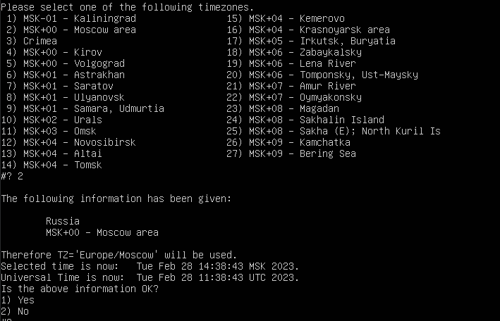
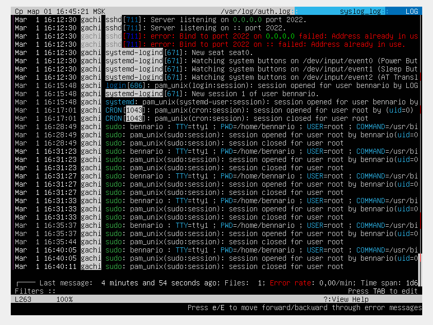

## Part 1. Установка ОС
* Устаналиваем Ubuntu и проверяем версию командой `cat /etc/issue`

## Part 2. Создание пользователя

* Создаем пользователя командой `sudo adduser (username)`

* [Более подробная информация по утилите adduser](https://www.opennet.ru/man.shtml?topic=adduser&category=8&russian=0)
* Создаем друппу adm и обавляем права для пользователя с помощью команды: `sudo groupadd adm` и `sudo usermod -a -G adm bennario-2`

* Вывод команды `cat /etc/passwd`

## Part 3. Настройка сети ОС.
* 1. Задаём название машины:sudo

`sudo hostnamectl set-hostname gachi` 

* 2. Задаем время, на Московское. Для этого выбираем Европу, затем Россию, затем Москву и подтверждаем:

`tzselect` ;

Или можно выполнить эту команду: `sudo timedatectl set-timezone Europe/Moscow`

* 3. Выясняем внешний **ip-адрес** , **ip-адрес** устройства , внутренний **ip-адрес** шлюза(**gw**) , а также выводим названия сетевых интерфейсов.
* Адрес устройства:

   ` hostname -I ` 

* Внешний адрес:

  ` curl 2ip.ru ` 

* gw:

  `ip r | grep def | grep -Eo '[0-9.]*' | head -n 1`

* Названия сетевых интерфейсов:

  ` ifconfig `

* 4. Сетевые интерфейсы.

* **lo** - интерфейс обратной петли (loopback) позволяет компьютеру обращатся к самому себе. Интерфейс имеет ip-адрес 127.0.0.1 и может быть использован сетевым клиентским программным обеспечением, чтобы общаться с серверным приложением, расположенным на том же компьютере.
* **DHCP (Dynamic Host Configuration Protocol)** — протокол прикладного уровня модели TCP/IP, служит для автоматизации назначения IP-адреса клиенту. Сервер всегда слушает 67 порт, ожидает широковещательное сообщение от клиента, а после его получения отправляет ответное предложение — DHCPOFFER. Клиент принимает сообщение на 68 порту.

*  Задаем статичные настройки **ip, gw, dns** в файле конфигурации netplan:

* Сперва вводим команду:

  ` nano /etc/netplan/*.yaml `

* Откроется nano туда вставляем следующий текст для изменения сетевых конфигураций на нужные нам:

* Подтверждаем конфигурации:

  `sudo netplan try`

* Перезагружаем машину:

  `shutdown -r now`

* Пингуем `1.1.1.1` и `ya.ru`:

## Part 4. Обновление ОС.

* Начинаем процесс обновления командой `sudo apt-get update` для обновления информации о пакетах, далее `sudo apt-get dist-upgrade` для продвинутого механизма разрешения конфликтов;

## Part 5. Использование команды sudo.

* Команда **sudo** ( substitute user and do, подменить пользователя и выполнить ) позволяет строго определенным пользователям выполнять указанные программы с административными привилегиями без ввода пароля суперпользователя root.

* Пользователю **bennario-2**, выдадим привелегии: `sudo usermod -aG sudo bennario-2`;

* Вводим команду: `su - bennario-2`, чтобы перейти на учетную запись **bennario-2**;

* Так изначально поставилась **машина gachi**, сделаем перебежку названии хоста командой `sudo -u bennario-2 sudo hostnamectl set-hostname gachi`

## Part 6. Установка и настройка службы времени.

* Дату и время мы установили еще в **Part 2** , но давайте проверим правильность установленного времени с помощью команд:

`date;
timedatectl show;`

## Part 7. Установкаи и использование текстовых редакторов.

* Основная цель задания - Установить текстовые редакторы VIM (+ любые два по желанию NANO, MCEDIT, JOE и т.д.)
  Используя каждый из трех выбранных редакторов, создайте файл test_X.txt, где X -- название редактора, в котором создан файл. Напишите в нём свой никнейм, закройте файл с сохранением изменений.

* 1. NANO:
  * `nano test_nano.txt`;
  * Введите свой ник (**bennario**);
  * Нажмите **Cmd+O**, **Enter** для сохранения и **Cmd+X** для выхода;
  
  

  * Нажимте **Cmd+\\**, введите строку, которую необходимо искать (**bennario**) и нажмите клавишу **Enter**. Затем введите строку, на которую произвести замену (**21 School 21**) и нажмите **Enter**;
  
  

  * нажмите клавишу **A** для замены всех вхождений строки;
  
  

  * Нажмите **Cmd+X** для выхода;
  * Нажмите **N** для выхода без сохранения изменений;
  
  

* 2. Vim
  * `vim test_vim.txt`;
  * Введите свой ник (**bennario**). Для этого нужно перейти в режим редактирования путем нажания клавиши **i**;
  * Для выхода с сохранением нажмите **ESC** , затем введите **:wq**. Для подтверждения нажмите **Enter**;
  
  

  * Для замены (**bennario**) на (**21 School 21**) в **vim** -  **ESC** **:%s/слово/замена слово**;
  
  

  * Для выхода без сохранения нажимаем **ESC** , **SHIFT + вводим q!**. Для подтверждения нажмите **Enter**;
  
  

* 3. MCEDIT

  * Устанавливаем MCEDIT `sudo apt-get install mcedit`;

  * `mcedite test_mcedit.txt`;
  * Введите свй ник (**bennario**);
  * Для сохранения нажмите **F2(save)** , затем нажмите **F10exit** для выхода
  
  

  * Меняем (**bennario**) на (**21 School 21**);
  
  

  

  * Для выхода без сохранения нажмите **F10** , затем перевидите указатель на **NO**. Для подтверждения нажмите **Enter**;
  
  
  
## Part 8. Установка и базовая настройка сервиса SSHD.
* Устанавливаем и настраиваем SSH-сервер с помощью команд:

      sudo apt-get update &&
      sudo apt-get install openssh-server net-tools && 
      sudo systemctl enable ssh &&  # добавляем сервер в автозапуск
      sudo sed -i '/Port/c\Port 2022' /etc/ssh/sshd_config &&  # изменяем порт
      sudo systemctl restart sshd;
      clear;
      ps -C sshd;
      netstat -tan;

  

* Опции утилиты **ps**:
  * -A, -e - выбрать все процессы;
  * -a - выбрать все процессы, кроме фоновых;
  * -d - выбрать все процессы, даже фоновые, кроме процессов сессий;
  * -N - выбрать все процессы кроме указанных;
  * -С - выбирать процессы по имени команды;
  * -G - выбрать процессы по ID группы;
  * -p - выбрать процессы PID;
  * --ppid - выбрать процессы по PID родительского процесса;
  * -s - выбрать процессы по ID сессии;
  * -t - выбрать процессы по tty;
  * -u - выбрать процессы пользователя;
  * -x - найти все вхождения строки поиска.
  * Опции форматирования:
    * -с - отображать информацию планировщика;
    * -f - вывести максимум доступных данных, например, количество потоков;
    * -F - аналогично -f, только выводит ещё больше данных;
    * -l - длинный формат вывода;
    * -j - вывести процессы в стиле Jobs, минимум информации;
    * -M - добавить информацию о безопасности;
    * -o - позволяет определить свой формат вывода;
    * --sort - выполнять сортировку по указанной колонке;
    * -L - отображать потоки процессов в колонках LWP и NLWP;
    * -m - вывести потоки после процесса;
    * -V - вывести информацию о версии;
    * -H - отображать дерево процессов.

* Опции утилиты **netstat**:
  * -n - Отображение адресов и номеров портов в числовом формате.
  * -a - Отображение всех подключений и ожидающих портов.
  * -t - Отображение текущего подключения в состоянии переноса нагрузки с процессора на сетевой адаптер при передаче данных.

## Part 9. Установка и использование утилит top, htop.
  * По выводу команды top определить и написать в отчёте:

  * uptime:

  

  * количество авторизованных пользователей:

  

  * Общая загрузка системы:

  

  * общее количество процессов:

  

 * загрузка cpu:
 
  

  * Загрузка памяти:

  

  * Pid процесса занимающего больше всего памяти:

  

  * Pid процесса, занимающего больше всего процессорного времени:

  

* Вывод htop по отсортированным **PID**,**PERCENT_CPU**,**PERCENT_MEM**, **TIME** .
* Сортируем с помощью команды ` htop -s " "`.

* PID:

  

* PERCENT_CPU:

  

* PERCENT_MEM:

  

* TIME:

  

* Отфильтрованному для процесса sshd:
  Нажмите **F4** - для того, чтобы на шаг стать ближе к завершению нужного действия, после запуска **htop**.

  

* С процессом syslog, найденным, используя поиск:
  Нажмите **F3** - для того, чтобы на шаг стать ближе к завершению нужного действия, после запуска **htop**.

  

* С добавленным выводом hostname, clock и uptime:
  Нажмите **F2** - для того, чтобы на шаг стать ближе к завершению нужного действия, после запуска **htop**.
  
  

## Part 10. Использование утилиты fdisk.

* Запустить команду `sudo fdisk -l`.

**В отчёте написать название жесткого диска, его размер и количество секторов, а также размер swap.**

* Полное название жесткого диска:

  * Общее название: **Disk /dev/sda**
  * Disk model: **VBOX HARDDISK**
  * Disk identifier: **AE794673-E7C6-4E52-876D-02EA22748B69** ;

* Размер жесткого диска: **25GB**;
* количество секторов: **52428800 sectors**;
* размер swap **2.0 GB**
* Размер swap так же можно узнать с помощью `free -h`

  

  

## Part 11. Использование утилиты df.

**Запускаем команду df**.
    Прописываем ` /` через пробел, для того, чтобы попасть в корневой раздел;
* размер раздела: **11758760 KB**;
* размер занятого пространства: **4901996 KB**;
* размер свободного пространства: **6237656 KB**;
* процент использования: **45%**;

  

**Запустить команду df -Th**.
Прописываем ` /` через пробел, для того, чтобы попасть в корневой раздел;

* размер раздела: **12 G**;
* размер занятого пространства: **4,7 G**;
* размер свободного пространства: **6.0 G**;
* процент использования: **45%**;
* тип файловой системы: **ext4**;

  

## Part 12. Использование утилиты du.

* Нужно вывести размер папок /home, /var, /var/log (в байтах, в человекочитаемом виде) с помощью **du**;

* Для этого вводим команду `sudo du -hs -B KB /"путь к папке"`;

* /home:
* /var:
* /var/log:

  

* Вывести размер всего содержимого в /var/log (не общее, а каждого вложенного элемента, используя *):

  

## Part 13. Установка и использование утилиты ncdu.

* Установить утилиту ncdu. `sudo apt install ncdu`.
* Вывести размер папок /home, /var, /var/log.

* /home:

* /var:

* /var/log:

## Part 14. Работа с системными журналами.

* Написать в отчёте время последней успешной авторизации, имя пользователя и метод входа в систему.

* Устанавливаем **lnav** c помощью команды `sudo apt-get install lnav -y` .

* Проверяем последний вход командой `last -1`.

* С помощью команды **lnav** смотрим следующие логи:

* 1. /var/log/dmesg:

     

* 2. /var/log/syslog:

     

* 3. /var/log/auth.log:

      

Открыв **/var/log/auth.log** становится ясно, что последняя успешная авторизация - bennario в 16:15:48.

* Перезапустить службу SSHd.
  `sudo systemctl restart ssh`;

## Part 15. Использование планировщика заданий CRON.

* Используя планировщик заданий, запустите команду uptime через каждые 2 минуты.
* Вводим команду `crontab -e`
  Затем задаем **uptime** каждые 2 минуты:

  

* Найти в системных журналах строчки (минимум две в заданном временном диапазоне) о выполнении:

  

* Для вывода списка текущих заданий **CRON** используем команду `crontab -l`:

  

* Удалите все задания из планировщика заданий командой `crontab -r` и проверим с помощью `crontab -l`:

  